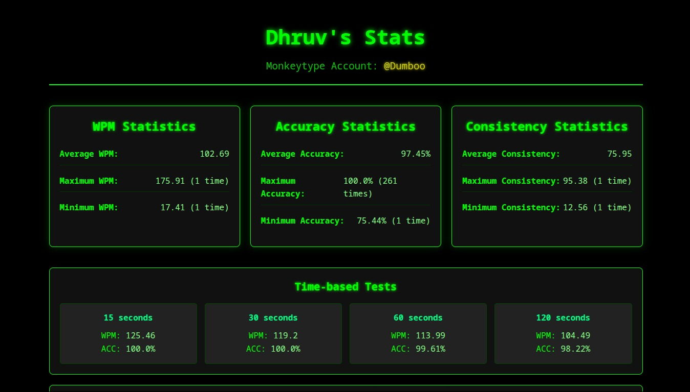

# Monkeytype Stats Web App
A simple Flask web application that displays typing statistics from Monkeytype using Python scripts. The app integrates custom scripts (like WPM stats) and presents the results on a web page.
Deployed with render :- https://my-monkeytype-stats.onrender.com/

